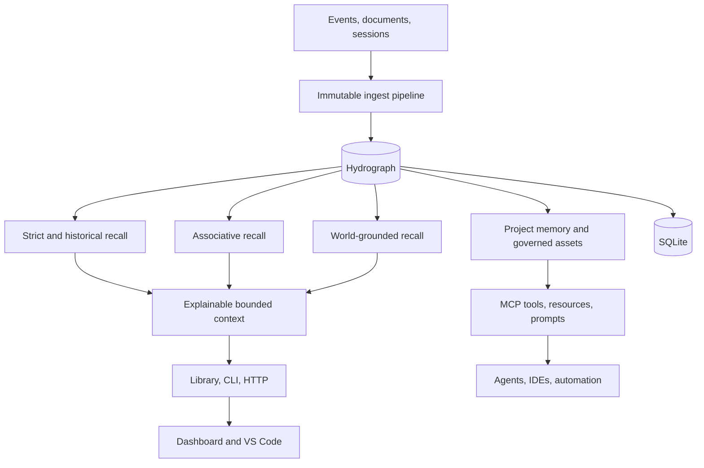

<!--
     __                      __  ___
    / /   ____  ____  ____ _/  |/  /__  ____ ___  ____  _______  __
   / /   / __ \/ __ \/ __ `/ /|_/ / _ \/ __ `__ \/ __ \/ ___/ / / /
  / /___/ /_/ / / / / /_/ / /  / /  __/ / / / / / /_/ / /  / /_/ /
 /_____/\____/_/ /_/\__, /_/  /_/\___/_/ /_/ /_/\____/_/   \__, /
                     /____/                                 /____/

 cavira oss (c) 2026  -  nullure (c) 2026
 ==========================================================
 file  : README.md
 usage : introduces LongMemory, its architecture, integrations, and deployment options
-->

# LongMemory

> **Durable, temporal, governed memory for AI agents. Not just RAG. Not just a vector database. Local-first and self-hosted.**

[](https://www.npmjs.com/package/longmemory)
[](https://marketplace.visualstudio.com/items?itemName=CaviraOSS.longmemory-vscode)
[](https://github.com/CaviraOSS/LongMemory/pkgs/container/longmemory)
[](LICENSE)


LongMemory is a cognitive memory engine for LLM applications and autonomous agents.

- Durable local-first storage with SQLite
- Immutable content, provenance, and temporal truth
- Strict, historical, associative, grounded, and multilingual recall
- Explainable evidence selection and token-bounded context
- Governed project memory, Skills, Chat Memory, LLM-Wiki, and CodeGraph
- One TypeScript engine across npm, CLI, HTTP, MCP, dashboard, and VS Code
- Native integrations for agent hosts, automation tools, and Python frameworks

Your model stays stateless. **Your application stops being amnesiac.**

---

## 1. Use It in 10 Seconds

### Install as a library

```bash
npm install longmemory
```

```ts
import { createMemory } from 'longmemory';

const memory = await createMemory();
await memory.ingest({
    user_id: 'alice',
    text: 'I prefer TypeScript for backend services',
});

const result = await memory.recall({
    text: 'What language does Alice prefer?',
    mode: 'strict',
});

console.log(result);
await memory.close();
```

No service or external database is required for in-memory use.

### Persist with SQLite

```ts
const memory = await createMemory({
    store: 'sqlite',
    db_path: './longmemory.db',
    tenant_id: 'acme',
    user_id: 'alice',
});
```

Reopening the same database restores nodes, worlds, entities, edges, temporal history, grounding, and lifecycle state.

### Install the CLI

```bash
npm install --global longmemory
longmemory init
longmemory recall "current project priorities" --mode associative
```

---

## 2. Run as a Service

### From source

```bash
git clone https://github.com/CaviraOSS/LongMemory.git
cd LongMemory
corepack enable
pnpm install --frozen-lockfile
pnpm build
pnpm start
```

The API listens on `http://127.0.0.1:7331` by default.

### Docker

```bash
docker run --rm \
  -p 7331:7331 \
  -v longmemory-data:/data \
  -e LONGMEMORY_API_KEY=change-me \
  ghcr.io/caviraoss/longmemory:latest
```

### Docker Compose

```bash
cp .env.example .env
docker compose up --build -d longmemory
```

Include the dashboard:

```bash
docker compose --profile ui up --build -d
```

- API and MCP: `http://127.0.0.1:7331`
- Dashboard: `http://127.0.0.1:3000`
- Health: `http://127.0.0.1:7331/health`

---

## 3. Why LongMemory

Most systems called memory are retrieval pipelines:

1. Split text into chunks.
2. Embed the chunks.
3. Return the nearest vectors.

That does not establish what was true at a particular time, whether a new fact superseded an old one, which source is authoritative, who may see it, or why a result belongs in context.

LongMemory models those concerns directly:

- **Temporal truth:** recorded time and valid time are separate.
- **Immutable memory:** content, vectors, hashes, and provenance are not rewritten by recall or decay.
- **Executable graph:** typed relationships participate in recall and explanation.
- **Governance:** project, tenant, user, team, role, agent, task, and framework scope are enforced.
- **Lifecycle:** deterministic decay, explicit reinforcement, consolidation, compression, and reconsolidation.
- **Evidence:** recall is bounded by relevance, contradictions, grounding, permissions, and token cost.

See [Why.md](Why.md) for the design rationale.

---

## 4. Recall Modes

```ts
const strict = await memory.recall({
    text: 'What is the current deployment region?',
    mode: 'strict',
});

const historical = await memory.recall({
    text: 'What was the deployment region in January?',
    mode: 'historical',
    valid_time: Date.UTC(2026, 0, 15),
});

const associative = await memory.recall({
    text: 'Incidents related to the payment migration',
    mode: 'associative',
});

const grounded = await memory.recall({
    text: 'Which production endpoint is currently live?',
    mode: 'world_grounded',
});
```

Strict recall applies temporal, contradiction, contract, confidence, and grounding gates. Historical recall preserves superseded truth. Associative recall follows semantic, lexical, entity, activation, and graph signals. World-grounded recall requires current external evidence.

---

## 5. Features

- **Hydrograph memory substrate** with immutable nodes, executable edges, worlds, entities, facets, and traces.
- **Temporal reasoning** with point-in-time truth, event ordering, supersession, and stale-evidence controls.
- **Multilingual memory** with script detection, code switching, transliteration, and cross-language embeddings.
- **Project memory** for architecture, decisions, tasks, conventions, failures, handoffs, and code impact.
- **Governed assets** for Chat Memory, Skills, LLM-Wiki, and CodeGraph with lifecycle and ACL policy.
- **Session porter** for Claude Code, Codex, OpenCode, Gemini CLI, Copilot Chat, Cline, and raw harness logs.
- **Connectors** for repositories, local files, Markdown, web content, feeds, cloud documents, and provider APIs.
- **Embeddings** through OpenAI-compatible APIs, Gemini, AWS Bedrock, Ollama, Siray, and local HTTP models.
- **Operational surfaces** through HTTP, MCP, dashboard, VS Code, n8n, and framework-native MCP clients.
- **Auditable benchmarks** for LongMemEval, LoCoMo, BEAM, retrieval quality, temporal behavior, and latency.

---

## 6. MCP and Agent Integrations

Start local stdio MCP:

```bash
longmemory mcp --db .longmemory/project.db --project current
```

Expose authenticated Streamable HTTP MCP:

```bash
LONGMEMORY_API_KEY=change-me longmemory serve --mcp-http
```

LongMemory exposes 13 high-level governed tools plus readable resources and agent workflow prompts. Tool arguments cannot override server-bound runtime identity.

Installable integrations include:

- Claude Code plugin
- Codex and ChatGPT desktop plugin
- Gemini CLI extension
- Agent Plugins 1.0 bundle for OpenClaw and compatible hosts
- n8n community node usable as an AI Agent tool
- Cline, Continue, and LibreChat configuration packs
- Dify and Flowise native MCP setup
- CrewAI, AutoGen, LangGraph/LangChain, OpenAI Agents SDK, and PydanticAI examples

See [integrations/README.md](integrations/README.md) and [docs/mcp.md](docs/mcp.md).

---

## 7. Temporal and Project Memory

```ts
import { createProjectMemory } from 'longmemory';

const projects = await createProjectMemory({
    tenant_id: 'cavira',
    organization_id: 'CaviraOSS',
    project_id: 'longmemory',
    name: 'LongMemory',
    store: 'sqlite',
    db_path: './longmemory.db',
});

await projects.ingestProjectEvent('longmemory', {
    kind: 'decision',
    topic: 'persistence',
    text: 'Use SQLite for local-first persistence',
    source_type: 'architecture_note',
});

const context = await projects.getProjectContext('longmemory', 'prepare the next release');
```

Project context combines relevant architecture, current decisions, open tasks, failures, code facts, matched Skills, conflicts, and governed asset loadouts under one token budget.

---

## 8. CLI

```bash
longmemory init
longmemory tui
longmemory status --memories 20 --json
longmemory ingest "Remember the rollback procedure" --type procedure
longmemory recall "What is the rollback procedure?" --mode associative
longmemory memory list --limit 50
longmemory project context "prepare the next release"
longmemory maintenance decay --all
longmemory maintenance reinforce <memory-id>
longmemory skill match "run the release checklist" --agent reviewer
longmemory asset loadout "prepare the release" --agent reviewer --framework codex
longmemory code impact createMemory
longmemory detect
longmemory session discover --from claude-code
longmemory port --from claude-code --to longmemory --all
longmemory session wiki --from gemini-cli --all --name "Project knowledge"
longmemory serve --mcp-http
```

Finite commands emit stable JSON outside a TTY or when `--json` is supplied. The session porter reads supported coding-agent stores without modifying them. See [docs/cli.md](docs/cli.md).

---

## 9. Dashboard and VS Code

The Next.js dashboard provides health, memory browsing, ingestion, search, project selection, activity, decay, settings, timelines, and memory-aware chat through a same-origin API proxy.

```bash
pnpm --dir dashboard build
pnpm --dir dashboard start
```

The VS Code extension provides an activity-bar browser, status bar, recall, project context, explanation, reinforcement, explicit decay, session import, and reviewed AI-change capture.

```bash
pnpm extension:package
```

The generated package is `apps/vscode-extension/longmemory-vscode-0.2.0.vsix`.

---

## 10. Architecture



Read [ARCHITECTURE.md](ARCHITECTURE.md) and [docs/architecture.md](docs/architecture.md) for subsystem details.

---

## 11. Deployment Options

| Platform       | Configuration          | What it deploys                           |
| -------------- | ---------------------- | ----------------------------------------- |
| Docker         | `Dockerfile`           | API and Streamable HTTP MCP               |
| Docker Compose | `docker-compose.yml`   | API/MCP plus optional dashboard           |
| Heroku         | `app.json`             | Containerized API/MCP                     |
| Railway        | `railway.json`         | Containerized API/MCP                     |
| Render         | `render.yaml`          | API/MCP with persistent disk              |
| DigitalOcean   | `.do/spec.yaml`        | App Platform API/MCP service              |
| Vercel         | `vercel.json`          | Dashboard; configure `LONGMEMORY_API_URL` |
| Windows        | `start-longmemory.ps1` | Background local API/MCP process          |

For hosted API deployments, set `LONGMEMORY_API_KEY`, mount persistent storage at `/data`, and terminate TLS at the platform edge. Vercel hosts only the stateless dashboard and requires a separately deployed LongMemory API.

---

## 12. Benchmarks

```bash
pnpm bench
pnpm bench:ci
pnpm bench:full
```

The benchmark harness publishes explicit manifests, dataset completion, evidence metrics, answer judgments, temporal categories, latency percentiles, and N/A reasons. Official scorecards fail closed on incomplete datasets or semantic embedding fallback. See [benchmarks/README.md](benchmarks/README.md).

---

## 13. Migration

Import supported SQLite, JSON, or JSONL memory:

```bash
longmemory migrate \
  --from ./legacy.db \
  --to ./longmemory.db \
  --report ./migration-report.json
```

Import coding-agent conversations as governed Chat Memory:

```bash
longmemory port --from codex --to longmemory --all
```

See [MIGRATION.md](MIGRATION.md) and [docs/migration.md](docs/migration.md).

---

## 14. Release and Operations

```bash
corepack enable
pnpm install --frozen-lockfile
pnpm release:check
pnpm pack
pnpm extension:package
```

`release:check` validates branding, types, integration manifests, the benchmark smoke gate, the root build, extension build, and dashboard production build.

Useful Make targets:

```bash
make install
make build
make check
make docker-up
make dashboard
```

---

## 15. Security

LongMemory is local-first, but network deployment still requires explicit controls:

- Protect API and MCP routes with `LONGMEMORY_API_KEY`.
- Restrict allowed origins and terminate TLS at the edge.
- Keep connector and embedding credentials outside repository files.
- Treat recalled content as untrusted evidence, not authorization.
- Preserve server-bound user, project, agent, and framework identity.

Report vulnerabilities privately as described in [SECURITY.md](SECURITY.md).

---

## 16. Contributing

Issues and pull requests are welcome. Read [CONTRIBUTING.md](CONTRIBUTING.md), [GOVERNANCE.md](GOVERNANCE.md), and [CODE_OF_CONDUCT.md](CODE_OF_CONDUCT.md) before contributing.

- Issues: https://github.com/CaviraOSS/LongMemory/issues
- Discussions: https://github.com/CaviraOSS/LongMemory/discussions
- Changelog: [CHANGELOG.md](CHANGELOG.md)

---

## 17. License

LongMemory is licensed under the [Apache License 2.0](LICENSE). The separately
published n8n community node uses MIT as required by n8n's strict package
validator.

## Contributors

<!-- readme: contributors -start -->
<!-- readme: contributors -end -->
