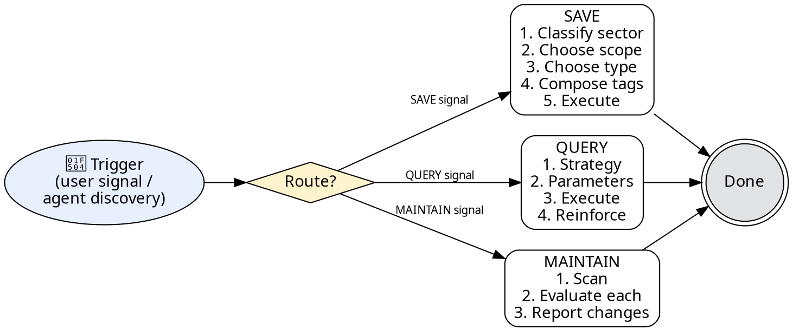

# OpenMemory — OpenMemory MCP Operation Playbook

## 1. Overview

This skill is the operational playbook for **OpenMemory (MCP)** — a **primary** persistent memory system; the file-based fallback is a **secondary index** only (one-line pointers, no full-text copies). Configure `project_id` based on your workspace (see §4 Step 2).

---

## 2. HARD-GATE

<HARD-GATE>
Any memory operation (save/query/maintain) MUST first go through OpenMemory MCP before considering any file-based fallback. If the auto-memory system attempts a direct write to a local file first, intercept and redirect to this skill's flow.
</HARD-GATE>

---

## 3. Flow Router

| Trigger Signal | Route | When |
|---|---|---|
| User says "remember this", "save to memory", "store this" — or agent forms a stable conclusion worth persisting | **SAVE** | Post-task, or at user request |
| User says "recall", "what do you remember about", "check memory" — or agent needs historical context before answering | **QUERY** | Pre-task, or when context is insufficient |
| User says "forget this", "delete memory", "clean up memory" — or agent discovers outdated/wrong/duplicated memory | **MAINTAIN** | On discovery or user request |

---

## 4. SAVE Flow (5 Steps)

### Step 1 — Classify sector

| Content Type | Sector | Example |
|---|---|---|
| Events / incidents that happened | `episodic` | "2026-05-20 deployment 回滚" |
| Facts / knowledge / decisions / preferences | `semantic` | "服务 A 依赖 服务 B 的 API v2" |
| Procedures / methods / rules / constraints | `procedural` | "部署前必须运行测试套件" |
| User emotions / reactions / preferences | `emotional` | "用户不喜欢冗长的总结" |
| Cross-event patterns / insights | `reflective` | "部署失败通常与配置缓存有关" |

### Step 2 — Choose scope

| Question | YES | NO |
|---|---|---|
| Is this specific to the current workspace/project? | `openmemory_store_project` (project_id: `"{{PROJECT_ID}}"`) | Go to next question |
| Is this general engineering knowledge? | `openmemory_store` (global) | Default to project scope |

Default bias: **project scope** (`openmemory_store_project`).

> **Note:** Set `{{PROJECT_ID}}` to your actual project identifier (e.g. `"my-project"`, `"airflow-agent"`, `"data-platform"`). This is a per-workspace configuration.

### Step 3 — Choose type

| Situation | `type` parameter |
|---|---|
| Narrative knowledge, experiences, preferences | `contextual` |
| Structured triples that change over time | `factual` (with `facts` array: `subject`/`predicate`/`object`) |
| Both narrative and structured content | `both` |

### Step 4 — Compose tags

Attach 2–5 lowercase hyphen-separated tags. Examples:

- `deployment`, `rollback`, `incident`
- `api`, `dependency`, `architecture`
- `user-preference`, `feedback`
- `pattern`, `decision`, `architecture`
- `workflow`, `ci-cd`, `config`

### Step 5 — Execute

1. Call the appropriate MCP tool (`openmemory_store_project` or `openmemory_store`) with sector, type, tags, and content.
2. Optionally add **one line** in a local index file pointing to the stored memory (never copy the full content).

---

## 5. QUERY Flow (4 Steps)

### Step 1 — Determine query strategy

| Need | `type` parameter | `sector` parameter |
|---|---|---|
| Generic "what do you know about X" | `contextual` | Omit |
| "What happened" (events) | `contextual` | `episodic` |
| "How to do X" (procedures) | `contextual` | `procedural` |
| "Current state / status" | `factual` | Omit |
| "What you know + changes over time" | `unified` | Omit |

### Step 2 — Set parameters

| Parameter | Value |
|---|---|
| `project_id` | `"{{PROJECT_ID}}"` (always, for project knowledge) |
| `k` (max results) | `8` (default; adjust up for broad searches) |
| `min_salience` | Omit or set as needed (higher filters to more relevant results) |

### Step 3 — Execute query

Call `openmemory_query` with the determined parameters.

### Step 4 — Reinforce if used

If the retrieved memory is directly used in the response, call `openmemory_reinforce` with a boost of `0.05`–`0.1` to strengthen its salience for future sessions.

---

## 6. MAINTAIN Flow (3 Steps)

### Step 1 — Scan

Call `openmemory_list` with:
- `project_id: "{{PROJECT_ID}}"` (omit for global scope)
- `sector` filter (optional)
- `limit: 20` (adjust for larger scans)

### Step 2 — Evaluate each entry

| Condition | Action |
|---|---|
| Accurate and still relevant | `openmemory_reinforce` (boost 0.1–0.3) |
| Outdated / superseded | `openmemory_delete` then re-store corrected version |
| Duplicate (same info, different entry) | Delete the entry with lower `salience` |
| Noise / useless | `openmemory_delete` |

### Step 3 — Report

Summarize to the user: what was deleted, reinforced, or corrected, and why.

---

## 7. Proactive Behaviors

### Pre-task query

Before a non-trivial task, silently query OpenMemory for relevant context. **Do not announce** the query itself — only inform the user if the retrieved memory would affect the task's direction or decisions.

### Post-task save

When the task produces a **stable conclusion** (not intermediate noise), save it. Briefly inform the user:

> "已存入 openmemory: [one-line summary]"

### Correction on discovery

If you notice an existing stored memory is factually wrong, immediately:
1. Delete the incorrect entry.
2. Save the corrected version.
3. Inform the user: "已更新 openmemory: [what changed]"

---

## 8. Decision Flow

---

## 9. Constraints (Anti-Pattern Table)

| Anti-Pattern | Correct Practice |
|---|---|
| Write to a local file first without hitting OpenMemory | **Always go through OpenMemory first** |
| Use `contextual` type for everything | Use `factual` (with `facts` array) for structured triples |
| Default to `global` scope | **Default to `project` scope** |
| Query without `project_id` | Always include `project_id: "{{PROJECT_ID}}"` for project knowledge |
| Store conversational history / intermediate noise | **Only store stable conclusions** |
| Save without tags | Always attach **2–5 tags** |
| Perform memory operations silently | Notify user on save; explicitly state when query returns empty |
